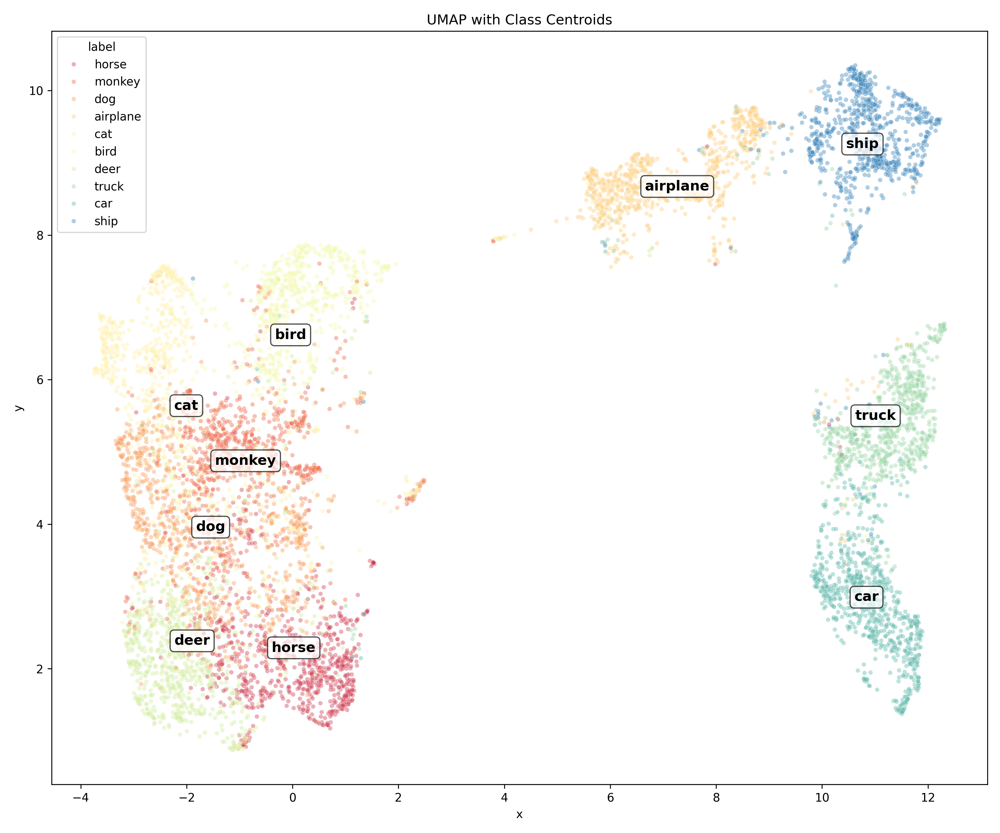
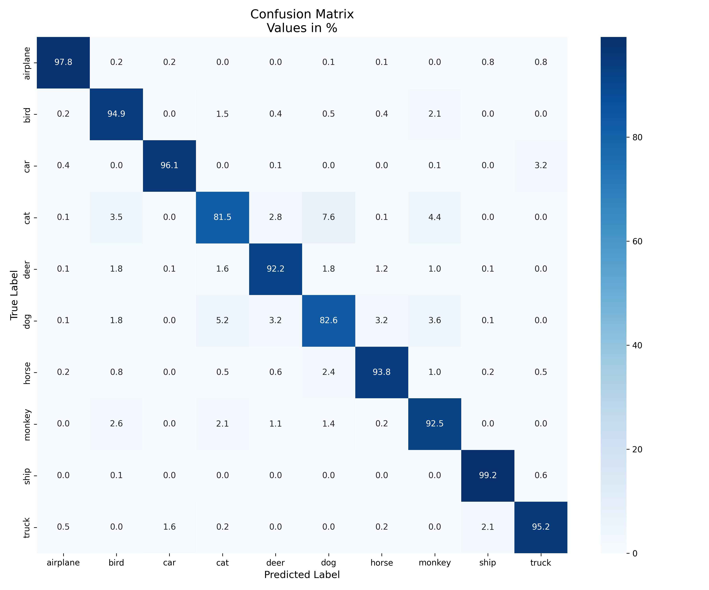
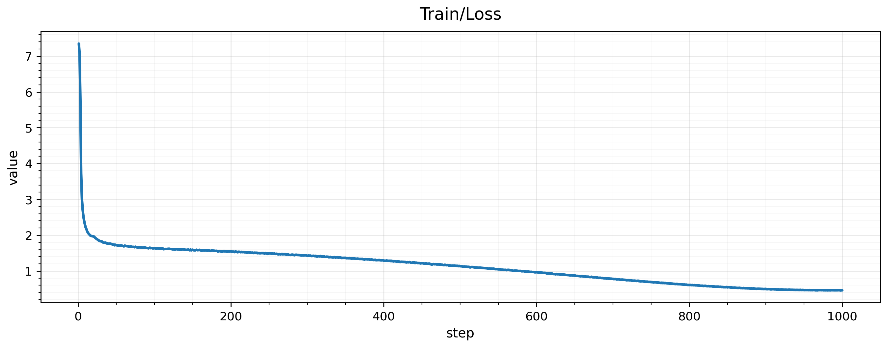
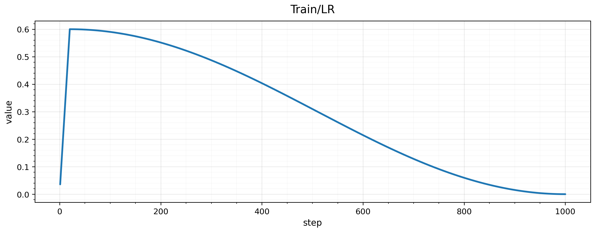

# SimCLR in PyTorch: STL-10 Reproduction


This repository provides a PyTorch implementation of *SimCLR: A Simple Framework for Contrastive Learning of Visual Representations* (Chen et al., ICML 2020).

The codebase focuses on reproducing the core SimCLR learning paradigm (stochastic augmentations, NT-Xent loss, non-linear projection head, and large-batch LARS optimization) applied to the **STL-10** dataset using a **ResNet-50** backbone.

## Methodology & Codebase Mapping

The implementation adheres to the original paper's architecture. The table below maps theoretical components to their concrete implementations in this repository:

| SimCLR Component | Paper Reference | Implementation |
|:---|:---|:---|
| **Pretraining Data** | Unsupervised image set | STL-10 (`split="unlabeled"`) via [`src/dataset.py`](src/dataset.py) |
| **Encoder $f(\cdot)$** | ResNet architecture | `torchvision.models.resnet50` (untrained, modified `conv1` for 96x96, `fc` replaced with `Identity`) |
| **Projection Head $g(\cdot)$** | 2-layer MLP | `Linear → BatchNorm → ReLU → Linear → BatchNorm` (matches the official implementation) in [`src/model.py`](src/model.py) |
| **Stochastic data augmentations** | Random augmentation pipeline | GPU-accelerated transforms via `kornia.augmentation` in [`src/augmentations.py`](src/augmentations.py) |
| **Loss Function** | NT-Xent Loss | `NTXentLoss` implemented in [`src/loss.py`](src/loss.py) |
| **Optimization** | Large-batch LARS | `torch_optimizer.LARS` configured in [`train.py`](train.py) |
| **LR Schedule** | Linear Warmup + Cosine Decay | `SequentialLR` (`LinearLR` → `CosineAnnealingLR`) |
| **Linear Evaluation** | Supervised fine-tuning (frozen $f$) | Implemented in [`src/eval.py`](src/eval.py) |

## Default Hyperparameters

The baseline experiment is defined in [`configs/config.yaml`](configs/config.yaml).

| Parameter | Value | Parameter | Value |
|:---|---:|:---|---:|
| **Input Resolution** | 96×96 | **Warmup Epochs** | 20 (Start factor: 0.01) |
| **Batch Size** | 512 | **Base Learning Rate**| 0.6 |
| **Training Epochs** | 1000 | **Min Learning Rate** | $10^{-6}$ |
| **Temperature $\tau$**| 0.1 | **Weight Decay** | $10^{-6}$ |

## Optimizations

To make training feasible and fast on modern hardware, the following optimizations are implemented:
* **Mixed Precision (AMP):** The forward pass and loss computation utilize `torch.amp.autocast` with `bfloat16` and `channels_last` memory format to maximize GPU throughput (see [`src/trainer.py`](src/trainer.py))
* **GPU-Accelerated Augmentations:** Training augmentations are executed directly on the GPU using `kornia` to prevent CPU-to-GPU memory bottlenecks during heavy data transformations. Evaluation relies on `torchvision.transforms.v2`.
* **Dataset Scope:** Pretraining is conducted on STL-10 (96×96) to enable faster experimentation while preserving the complexity of natural images.

## Evaluation & Results

Representations were evaluated using both Linear Evaluation (training a linear classifier on frozen features) and non-parametric $k$-NN. Detailed metrics are available in [`results.json`](results.json).

*Tested hardware: 1x NVIDIA RTX 5090*

| Checkpoint | Linear Eval (Top-1) | $k$-NN ($k=20$) |
|:---|:---:|:---:|
| `checkpoint.pth` (Last epoch) | **92.60%** | **87.15%** |
| `model_best.pth` (Lowest train loss) | 92.56% | 87.01% |

## Visualizations
To better understand the learned representation space and classifier performance, several visualization tools are included:


*UMAP Projection: 2D projection of the feature space extracted from the frozen encoder on the test split.*


*Confusion matrix: Per-class accuracy distribution of the linear evaluation model.*

## Training Dynamics

Training logs (loss and learning rate schedules) are tracked via TensorBoard. The corresponding event files are located in the [`runs/`](runs) directory.

<div align="center">
  
  
</div>

## Usage

### 1. Pretraining
To launch the pretraining pipeline the default configuration is used:

```bash
bash scripts/run_train.sh --config configs/config.yaml --tb
```

### 2. Evaluation
To run linear and $k$-NN evaluation on generated checkpoints:

```bash
bash scripts/run_eval.sh
```

### 3. Visualizations
To generate the visualization assets (ensure your models are trained and checkpoints exist):
```bash
# Plot 2D UMAP embeddings
python scripts/plot_umap.py --config configs/config.yaml --ckpt checkpoints/checkpoint.pth

# Plot Confusion Matrix for linear classifier
python scripts/plot_confusion_matrix.py --simclr_ckpt checkpoints/model_best.pth --linear_ckpt checkpoints/linear_classifier_checkpoint.pth

# Export TensorBoard scalar curves to PNGs
python scripts/export_tb_scalars.py --logdir runs --outdir assets
```

## Repository Artifacts
Pretrained weight and evaluation logs are provided for full reproducibility
```text
.
├── assets/                                 # Generated plots and visualizations
│   ├── confusion_matrix.png
│   ├── simclr_umap.png
│   ├── train_loss.png
│   └── train_lr.png
├── checkpoints/                            # Saved model weights
│   ├── checkpoint.pth                      # Final epoch encoder weights
│   ├── linear_classifier_checkpoint.pth    # Final epoch linear evaluation weights
│   ├── linear_classifier_model_best.pth    # Trained weights for linear eval with best val accuracy
│   └── model_best.pth                      # Encoder weights with lowest loss
├── runs/                                   # TensorBoard event files
│   └── events.out.tfevents.* # Training metrics and learning rate logs
└── results.json                            # Evaluation metrics output
```

## References

- SimCLR (Chen et al., ICML 2020): https://arxiv.org/abs/2002.05709
- Official TensorFlow Implementation (Google Research): https://github.com/google-research/simclr
- LARS (You et al., ICLR 2017): https://arxiv.org/abs/1708.03888
- STL-10 (Coates et al., AISTATS 2011): http://ai.stanford.edu/~acoates/stl10/
